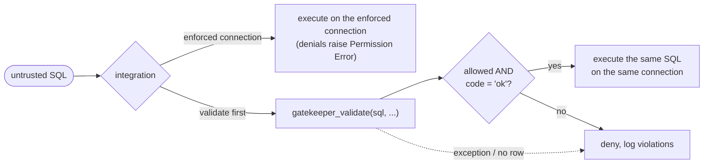

# Gatekeeper for DuckDB

A DuckDB extension that keeps untrusted SQL inside the lines you drew. Hand it a query
from a tenant, an LLM agent, or a dashboard builder and either ask it whether the query
conforms (`gatekeeper_validate`) or hand the agent an **enforced connection** on which
DuckDB itself refuses to run anything the policy denies (`CALL gatekeeper_enforce()`).

| Control | What it enforces |
| --- | --- |
| **Table ACL** | Once you configure `allowed_tables`, only the catalogs, schemas, tables, and views you allow, matched by their *resolved* identity after binding. Tables and views are **unrestricted by default**, except internal objects. |
| **Function ACL** | Only the functions you allow, starting from 953 reviewed defaults, with exact-name allow and block lists. |
| **Read-only, no introspection** | `SELECT` statements only. `INSERT`, `UPDATE`, `DROP`, `COPY`, `SET`, dynamic SQL, and catalog metadata readers (`duckdb_tables`, `information_schema.*`) are rejected. |

A lockable **global policy** sets the ceiling; per-request options can narrow it but never widen it.
Every validation decision comes back as one row of named columns with structured diagnostics;
every enforced denial is a `Permission Error` the statement never recovers from.

> [!WARNING]
> Gatekeeper is a **statement-level sandbox**, not an operating-system or resource
> sandbox. It does not filter rows, cap memory or time, or isolate the filesystem.
> Read the [security model](docs/security.md) before integrating.

> [!NOTE]
> Early development. Release binaries target **DuckDB 1.5.5**; community publication is pending.

## Installation

```sql
INSTALL gatekeeper FROM community;
LOAD gatekeeper;
```

> [!IMPORTANT]
> The `community` install becomes available once Gatekeeper is accepted into the DuckDB
> community repository. Until then, follow the
> [build and local-load instructions](CONTRIBUTING.md#building) and
> [loading unsigned builds](CONTRIBUTING.md#loading-unsigned-builds).

Community binaries are built and signed by DuckDB and load with signature verification
enabled. Source builds and the binaries attached to GitHub Releases are unsigned
development artifacts and require `allow_unsigned_extensions`.

Each binary is specific to the DuckDB engine it was built from and refuses to load into
any other, even when DuckDB's own footer check is disabled. The community repository
can rebuild Gatekeeper source for newer engines; source compatibility is checked by
builds and regression tests rather than a fixed release allowlist. Default functions are a
name list: new names remain excluded until added, and existing implementations are
trusted across DuckDB upgrades.
For browsers, the DuckDB-Wasm EH bundle is supported; see
[Wasm installation and browser tests](test/wasm/README.md).

## Quickstart

```sql
CREATE SCHEMA reporting;
CREATE TABLE reporting.orders (customer_id INTEGER, amount DOUBLE);
INSERT INTO reporting.orders VALUES (1, 20), (1, 30), (2, 15);
```

Allowed table, default functions:

```sql
SELECT allowed, code FROM gatekeeper_validate(
    'SELECT customer_id, sum(amount) FROM reporting.orders GROUP BY customer_id',
    allowed_tables := [{catalog: 'memory', schema: 'reporting', 'table': 'orders'}]
);
```

| allowed | code |
| --- | --- |
| true | ok |

DDL is never allowed:

```sql
SELECT allowed, code FROM gatekeeper_validate('DROP TABLE reporting.orders');
```

| allowed | code |
| --- | --- |
| false | unsupported |

Engine errors surface with their phase:

```sql
SELECT allowed, code FROM gatekeeper_validate('SELECT * FROM missing_table');
```

| allowed | code |
| --- | --- |
| false | binding |

> [!TIP]
> Two ways to integrate. **Enforced connection** (recommended for agents): run
> `CALL gatekeeper_enforce()` on the connection you hand out and execute SQL on it directly;
> denials raise. **Validate first**: require `allowed = true` **and** `code = 'ok'`, treat
> exceptions and missing results as denials, then execute the same SQL text on the same
> connection.



## Functions

```text
SELECT * FROM gatekeeper_validate(sql VARCHAR, option := value, ...) -- one result row
CALL gatekeeper_configure(option := value, ...)          -- replaces the global policy
CALL gatekeeper_enforce()                                -- latches this connection to the global policy
```

`gatekeeper_validate` and `gatekeeper_configure` take the same named options and accept
host-bound parameters (`?`, `$1`), so policies never need to be spliced into SQL text.
`gatekeeper_enforce` takes no options; see [Enforced connections](#enforced-connections).

Select `*` for all result columns or name just the columns you need. SQL text and
options must be constant expressions or host-bound parameters; correlated/lateral
per-row arguments are not supported. Use separate parameterized calls for multiple
SQL strings. Every execution, including a prepared execution, checks the current
global policy and binds the submitted SQL again.

| Bad input | `gatekeeper_validate` | `CALL gatekeeper_configure` |
| --- | --- | --- |
| Unknown/duplicate option name, wrong type | DuckDB error at bind | DuckDB error at bind |
| Invalid value (NULL list member, empty function name) | `code = 'invalid_input'` | Raises; policy unchanged |

Empty option lists accept any element type, since DuckDB resolves untyped `[]` to
`INTEGER[]` before table-function binding. All-NULL lists also pass the element-type
check regardless of their declared type: `[NULL]` and `[NULL]::DOUBLE[]` both return
`invalid_input` at execution. Lists with non-NULL members require the documented
element types. Typed STRUCT lists have their field names checked even when empty.

### Options

| Option | Type | Default | Notes |
| --- | --- | --- | --- |
| `allowed_tables` | STRUCT[] | unrestricted (non-internal) | `{catalog?, schema, table}`. `'*'` matches any whole component; omitted/NULL catalog matches any. `[]` denies all tables and views. Until this is set, every non-internal table and view is readable. |
| `blocked_tables` | STRUCT[] | `[]` | Same identity rules. A match always denies, including inside views and macros. |
| `use_default_functions` | BOOLEAN | `true` | `true`: 953 reviewed defaults **plus** `allowed_functions`. `false`: only `allowed_functions`. |
| `allowed_functions` | VARCHAR[] | `[]` | Leaf names, ASCII case-folded. `'*'` here is the multiplication operator, not a wildcard. |
| `blocked_functions` | VARCHAR[] | `[]` | Always wins, including inside trusted views and macros. |

Validation accepts exactly one nonempty statement. DuckDB ignores empty semicolon
segments, so `SELECT 1;`, `SELECT 1;;`, and `;SELECT 1` are accepted. Empty,
semicolon-only, or comment-only SQL returns `invalid_input`, and multiple statements
return `forbidden` with violation rule `limit`. The statement cap is fixed internally,
like the AST caps.

```sql
SELECT allowed FROM gatekeeper_validate('SELECT md5(''hello'')', blocked_functions := ['md5']);
```

| allowed |
| --- |
| false |

```sql
SELECT allowed FROM gatekeeper_validate('SELECT 1+2', use_default_functions := false, allowed_functions := ['+']);
```

| allowed |
| --- |
| true |

> [!NOTE]
> Authorize replacement-scan readers through function policy (see [File readers](#file-readers)).

### Result

Each call returns exactly one row unless it raises an exception. `violations`,
`objects`, and `functions` remain lists of STRUCTs within their respective columns.

| Column | Type | Meaning |
| --- | --- | --- |
| `allowed` | BOOLEAN | True exactly when `code = 'ok'`. |
| `code` | VARCHAR | `ok`, `forbidden`, `unsupported`, `parser`, `binding`, `invalid_input`. |
| `violations` | STRUCT[] | `rule`, `message`, `catalog`, `schema`, `table`, `function_name`, `position`. Nonempty only for `forbidden`/`unsupported`. |
| `error_type` | VARCHAR | DuckDB exception category (`parser`, `Catalog`, `Binder`, ...) when available. Empty for `ok`/`forbidden`/`unsupported`. |
| `error_message` | VARCHAR | The engine's message; empty for policy denials. |
| `position` | BIGINT | Zero-based parser byte offset, or NULL. |
| `objects` | STRUCT[] | Resolved `catalog`, `schema`, `table`, `type` (`table`/`view`/`replacement`) the query bound to. Empty unless `ok`. |
| `functions` | STRUCT[] | Resolved `catalog`, `schema`, `name`, `type` (`scalar`, `aggregate`, `table`, `macro`, `table_macro`, `pragma`, `window`). Empty unless `ok`. |

Violation `rule` values: `function`, `table`, `internal_object`, `dynamic_sql`,
`replacement_scan`, `bind_time_expression`, `statement`, `limit`, `unsupported_structure`.

> [!TIP]
> Branch on `code` and `violations[].rule`, not on message text.

```sql
SELECT * FROM gatekeeper_validate('SELECT 1');
```

| allowed | code | violations | error_type | error_message | position | objects | functions |
| --- | --- | --- | --- | --- | --- | --- | --- |
| true | ok | [] | '' | '' | NULL | [] | [] |

In these result tables, `''` denotes an empty string and `NULL` a SQL NULL.

<details>
<summary>The three failure shapes</summary>

**Table denied:** `code = 'forbidden'`, with a structured violation and no engine
error text. Project the first violation's fields to display them as columns:

```sql
SELECT allowed, code, violations[1].rule AS rule,
       violations[1].message AS message, violations[1].catalog AS catalog,
       violations[1].schema AS schema, violations[1]."table" AS "table"
FROM gatekeeper_validate('SELECT * FROM reporting.orders', allowed_tables := []);
```

| allowed | code | rule | message | catalog | schema | table |
| --- | --- | --- | --- | --- | --- | --- |
| false | forbidden | table | object is not allowed | memory | reporting | orders |

**Function denied:** `md5` is a default, but `current_setting` (configuration inspection) is not.

```sql
SELECT allowed, code, violations[1].rule AS rule,
       violations[1].message AS message, violations[1].function_name AS function_name
FROM gatekeeper_validate('SELECT md5(''x''), current_setting(''threads'')');
```

| allowed | code | rule | message | function_name |
| --- | --- | --- | --- | --- |
| false | forbidden | function | function is not allowed: current_setting | current_setting |

**Engine error:** the code identifies the phase and `violations` is empty. This
example displays the first line of DuckDB's error message, omitting suggestions:

```sql
SELECT allowed, code, violations, error_type,
       split_part(error_message, chr(10), 1) AS error_message
FROM gatekeeper_validate('SELECT * FROM missing_table');
```

| allowed | code | violations | error_type | error_message |
| --- | --- | --- | --- | --- |
| false | binding | [] | Catalog | Table with name missing_table does not exist! |

All three denials return empty `objects` and `functions` lists. Policy denials
have empty `error_type` and `error_message`; the details are in `violations`.

</details>

`objects` and `functions` are sorted, deduplicated binding evidence: views appear with
their underlying tables; CTE names do not. They help detect search-path surprises but do
not prove definitions are unchanged between validation and execution.

## Table ACL

> [!IMPORTANT]
> Tables and views are unrestricted by default, except internal objects. Configure
> `allowed_tables` in the global policy to restrict access; `[]` denies all tables and views.

Rules match all three components of a **resolved** table or view identity, ASCII
case-insensitively. Any matching allow grants; any matching block wins.

```sql
SELECT allowed FROM gatekeeper_validate(
    'SELECT * FROM reporting.orders',
    allowed_tables := [{catalog: '*', schema: 'reporting', 'table': '*'}]
);
```

| allowed |
| --- |
| true |

| Intent | Rule |
| --- | --- |
| One table | `{catalog: 'memory', schema: 'reporting', 'table': 'orders'}` |
| One schema | `{schema: 'reporting', 'table': '*'}` |
| Whole catalog | `{catalog: 'warehouse', schema: '*', 'table': '*'}` |
| Everything except one | allow `{catalog: 'warehouse', schema: 'reporting', 'table': '*'}`, block `{..., 'table': 'sensitive_orders'}` |
| Nothing | `allowed_tables := []` |

Multiple entries pair specific catalogs and schemas without granting their cross-product.
Blocks apply to views and their underlying tables, including references introduced by
macros; they match resolved objects, not CTE names, file paths, or reader arguments.

> [!IMPORTANT]
> Only a whole-component `'*'` is a wildcard. `sales_*`, `?`, and `%` are literal names.
> Wildcards also match objects created or attached **later**, and `catalog: '*'` matches
> temporary shadow tables. Prefer explicit catalog names when that scope is not intended.

> [!NOTE]
> **Internal objects** (`duckdb_*`, `information_schema.*`) need a rule with exact schema
> and table names in each policy layer; schema/table wildcards never grant them, though
> the catalog may be `'*'` or omitted. Block wildcards do match them. Metadata *readers*
> stay on the never-bind list regardless. Schema-wide `SHOW` is denied whenever any table
> restriction is configured; `DESCRIBE table` checks the resolved table normally.

Table rules govern tables and views only. Types, casts, and collations are trusted as
part of the host-configured database and need no Gatekeeper permission by name.
Function policy still applies to the implementations they bind: `'a' COLLATE nocase = 'A'`
is denied under `blocked_functions := ['lower']` because the comparison binds `lower`.
See [callback bypasses](docs/security.md#callback-bypasses).

## Function ACL


- Caller-written scalar, aggregate, window, and table functions (`FROM range(...)`,
  `FROM read_parquet(...)`) all use the same policy, by leaf name.
- Functions that trusted **views and macros** introduce internally are normally exempt
  from the allowlist but always honor `blocked_functions` and the never-bind list. The
  exemption is not unconditional: ambiguous caller syntax such as `t.x` or `list[i]`
  triggers a query-wide implementation check that can also reach a trusted expansion
  using the same function (for example `struct_extract`). See
  [function enforcement and trusted expansion](docs/security.md#function-enforcement-and-trusted-expansion).
- The global policy and the request must each grant a function; a request cannot add
  one the global policy denies.

Blocks also cover bound implementations: `unnest` inside a view, `lower` introduced
by `nocase` comparisons inside list lambdas, and `sum` dispatched by `list_sum`.
These implementations are included in successful function dependency lists.
When the caller writes a name-selected dispatcher (`list_aggregate`, `list_aggr`,
`aggregate`, `array_aggregate`, `array_aggr`), the aggregate it names is caller-chosen
text and must also be allowed in both layers, not merely unblocked.

> [!NOTE]
> Catalog, session, and configuration inspection (`current_schema`, `current_setting`,
> `getvariable`, `duckdb_tables()`) is **not** a default. Grant it by name in the global
> policy: `allowed_functions := ['current_schema']`. The clock (`current_date`, `now()`),
> the connection-local RNG (`random()`, `uuid()`, `setseed()`), and PostgreSQL
> compatibility stubs (`current_user`, `pg_typeof`) are defaults because they disclose
> nothing about the host beyond the time and its `TimeZone`/`Calendar`, and `setseed` touches only
> the connection's own random engine. The criteria are in
> [inventories/README.md](inventories/README.md#classification-criteria).

### File readers

Readers such as `read_parquet`, `read_csv`, and `read_json` are **not** defaults.
Admitting one permits its resource access; `allowed_tables` does not restrict file paths.

| Shorthand | Reader that must be allowed |
| --- | --- |
| `FROM 'x.parquet'` | `read_parquet` or `parquet_scan` (one shared permission) |
| `FROM 'x.csv'` | `read_csv_auto` (`read_csv` alone is not enough) |
| `FROM 'x.json'` | `read_json_auto` (`read_json` alone is not enough) |

The decision is made before the reader binds, so a denied path is never opened. Allowed
paths appear in `objects` with type `replacement`. Host-language scans (DataFrames,
relations in scope) are always denied.

### Never-bind list

Denied regardless of options, in every layer:

- Dynamic SQL: `query`, `query_table`, `json_execute_serialized_sql`, `json_serialize_plan`
- Metadata readers: `duckdb_tables`, `information_schema.*`, `SHOW TABLES`
- Sequence and storage functions
- `gatekeeper_configure` itself, including through views or macros

The full list is in [docs/security.md](docs/security.md#never-bind-functions).

## Global policy

The global policy is a ceiling that request options can only narrow.


| Dimension | How the layers combine |
| --- | --- |
| Blocks and the never-bind list | Either layer's deny wins. |
| Allowlists (functions, tables) | Each layer must allow the resolved identity. |

```sql
CALL gatekeeper_configure(
    allowed_tables := [{catalog: 'memory', schema: 'reporting', 'table': '*'}],
    blocked_functions := ['md5']
);
```

| Success |
| --- |
| true |

```sql
SELECT allowed FROM gatekeeper_validate('SELECT md5(''hello'')', blocked_functions := []);
```

| allowed |
| --- |
| false |

The request cannot clear a global block. The global policy still lists the block:

```sql
SELECT current_setting('gatekeeper_policy').blocked_functions AS blocked_functions;
```

| blocked_functions |
| --- |
| [md5] |

A request that tries to widen access does not error; it simply cannot authorize anything
the global policy denies. Grant capabilities (such as readers) in
`CALL gatekeeper_configure`, then use request options to narrow per tenant.

| Operation | SQL |
| --- | --- |
| Inspect | `SELECT current_setting('gatekeeper_policy')` |
| Reset to built-ins | `RESET gatekeeper_policy` or `CALL gatekeeper_configure()` |
| Freeze | `SET lock_configuration = true` after trusted setup |
| Allow later changes while locked | `SET allowed_configs = ['gatekeeper_policy']` before locking |

> [!IMPORTANT]
> Each `CALL` **replaces** the policy atomically, filling omitted options from the
> built-in defaults. The policy is shared by every connection of the database instance,
> not persisted, and not undone by rollback. `SET SESSION`/`RESET SESSION` are rejected.

<details>
<summary>Setting the policy directly with <code>SET gatekeeper_policy</code></summary>

Prefer `CALL gatekeeper_configure`: it validates option names, types, and nested identity
fields before DuckDB's casts. `SET gatekeeper_policy = <STRUCT>` also works but requires
the **complete canonical STRUCT**: every option plus the `restrict_tables` flag, with no
NULL at any depth. `SET gatekeeper_policy = {blocked_functions: ['md5']}` fails with
`NULL policy field: use_default_functions`; start from
`current_setting('gatekeeper_policy')` and `struct_update` it instead.

DuckDB silently drops unknown keys during the cast: a complete canonical STRUCT with
an extra field succeeds, but that field has no effect (unlike an unknown option in
`CALL gatekeeper_configure`, which errors). Because the canonical value is NULL-free
(`catalog: ''` means any catalog), a typo that displaces a required field fails closed.
Check the readback.

When setting `allowed_tables` directly, also set `restrict_tables := true`; a nonempty
list with `restrict_tables = false` is rejected. With an empty list,
`restrict_tables = true` denies all tables/views and `false` disables the allowlist for
non-internal objects. `blocked_tables` applies regardless of `restrict_tables`.

</details>

## Enforced connections

An enforced connection is one where DuckDB itself refuses to run anything the global policy
denies. There is no host glue to forget: the agent gets a connection, and every statement it
submits is checked the way `gatekeeper_validate` would check it, then the plan the engine is
about to execute is checked again.

Latch a single connection:

```sql
SELECT enforced FROM gatekeeper_enforce();
```

| enforced |
| --- |
| true |

The full `CALL gatekeeper_enforce()` row also carries a `warnings` list naming host settings
that weaken the sandbox (`enable_external_access`, `autoload_known_extensions`,
`lock_configuration`). Gatekeeper reports them; it never changes them.

From then on, on that connection only, allowed reads work as before:

```sql
SELECT sum(amount) FROM reporting.orders;
```

| sum(amount) |
| --- |
| 65.0 |

and everything else fails before it can execute:

```text
D CREATE TABLE scratch AS SELECT * FROM reporting.orders;
Permission Error: Gatekeeper denied this statement (unsupported): statement: only supported read statements are permitted
D SELECT * FROM read_csv('/etc/passwd');
Permission Error: Gatekeeper denied this statement: function: function is not allowed: read_csv
D SELECT * FROM secret.salaries;
Permission Error: Gatekeeper denied this statement: table: object is not allowed
```

The latch is **irreversible for the life of the connection** and lives in the connection's own
state, not in a setting, so neither `RESET` nor a native configuration write releases it. Denied
statements are ordinary errors: the transaction survives, and the agent can try again.

To latch connections wholesale instead of one at a time, set the global mode:

| `SET gatekeeper_enforcement = ...` | Effect |
| --- | --- |
| `'off'` (default) | Only connections that ran `CALL gatekeeper_enforce()` are enforced. |
| `'new_connections'` | Every connection opened after this point is enforced. Existing connections, including the one issuing the `SET`, are not. |
| `'all'` | Every connection open now, including this one, and every later one. |

Switching the mode back never releases a latched connection. The setting is global-only,
rejects other values, and is frozen by `SET lock_configuration = true` like `gatekeeper_policy`.
Global modes also latch connections that extensions open internally (some lakehouse
catalogs run their own metadata SQL that way); prefer per-connection latching with such catalogs.

Recommended host sequence: load extensions and attach catalogs, `CALL gatekeeper_configure(...)`,
tighten `enable_external_access` and autoload where the deployment allows, `SET lock_configuration = true`,
then hand out enforced connections.

What enforcement changes and does not change:

- Parameters are supported (`execute(sql, [values])`): the statement is authorized with the
  values it is bound with, and every execution, including cached prepared statements, is rebound
  and re-checked under the policy current at that moment.
- DuckDB's relation API is covered: the relation's SQL rendering passes the text check and the
  plan passes the execution check.
- `PRAGMA version` and other pragmas that DuckDB rewrites into `SELECT`s before any extension
  runs are checked as that `SELECT`; `gatekeeper_validate` reports the raw `PRAGMA` text as
  `unsupported`. DuckDB also **evaluates `PRAGMA` argument expressions** during that rewrite,
  before Gatekeeper can act: `PRAGMA x(nextval('s'))` advances `s` on an enforced connection
  even though the statement is then denied. See the
  [residuals](docs/security.md#residuals) before exposing sequences or sensitive settings.
- `gatekeeper_validate` is available on an enforced connection when the policy allows it
  (`allowed_functions := ['gatekeeper_validate']`), for agents that want a structured dry run.
- Each statement costs up to three binds (a private authorizing bind, the engine's bind, and a
  rebind for prepared executions). This is negligible next to model latency but measurable on
  hot paths; keep enforced connections for untrusted callers.

Enforcement is a statement-level sandbox: it decides what a statement may reference and
execute. Memory, time, filesystem and network posture remain host responsibilities; see the
[security model](docs/security.md#enforced-connections).

## How it works


1. **Parse** the SQL and require exactly one statement.
2. **Inspect the AST** for statement type, dynamic SQL, never-bind functions, and
   bind-time expressions the caller wrote.
3. **Bind** on your connection, using the caller's search path and transaction.
4. **Authorize** every resolved table and view, plus each caller-requested function,
   against both the global policy and the request layer.
5. **Check the plan**: only reviewed read operators, resolved functions and implementations
   chosen during binding pass.
6. **Return** one result row with named columns. The submitted SQL is not executed.

On an enforced connection, steps 1 to 5 run inside DuckDB's own query hooks with the
global policy as both layers, and step 5 runs once more on the plan the engine is about to
execute. A failure at any step raises; nothing executes.

> [!CAUTION]
> Binding **can perform I/O** through trusted catalogs and explicitly admitted readers.
> Type resolution can also autoload or autoinstall extensions when those settings are on.
> Provision extensions during trusted setup and disable `autoload_known_extensions` and
> `autoinstall_known_extensions` on validation connections.

### Things that surprise people

- Objects are authorized by their **resolved** identity. Views and the tables behind them
  must both pass.
- Prepared parameters validate only when DuckDB can finish binding without values
  (`WHERE id = ?`, `LIMIT ?`, `$1::INTEGER`). Bare `SELECT $1` returns `binding`.
  Deferred function binds (`list_sum($1)`) and incompatible uses of one parameter
  (`WHERE integer_column = $1 LIMIT $1`) also return `binding`; use concrete casts
  or separate parameters where appropriate.
- Expressions in bind-time positions (LIMIT, reader arguments, type parameters, PIVOT
  values) must be literals or parameters; `range(1+2)` is rejected. The one exception is a
  **correlated** call to `unnest`, `range`, or `generate_series`, whose arguments DuckDB
  evaluates per row: `FROM t, unnest(list_transform(t.arr, lambda x: x + 1))` is accepted.
- File-shaped catalog names such as `"data.parquet"` use ordinary table policy when they
  resolve to a catalog object. Unclaimed names return binding errors.
- Function policies apply by name, so blocking a table function also blocks a scalar
  function sharing that name. To deny default row generators, add them to
  `blocked_functions` or set `use_default_functions := false`.

## Python

```python
import duckdb

db = duckdb.connect()
db.execute("INSTALL gatekeeper FROM community")
db.execute("LOAD gatekeeper")
db.execute("CREATE SCHEMA reporting")
db.execute("CREATE TABLE reporting.orders AS SELECT 20.0 AS amount")

# Trusted setup: install the ceiling, then lock it.
tables = [{"catalog": "memory", "schema": "reporting", "table": "*"}]
db.execute("CALL gatekeeper_configure(allowed_tables := ?)", [tables])
db.execute("SET lock_configuration = true")

# Enforced connection: hand this cursor to the agent. Denials raise duckdb.PermissionException.
agent = db.cursor()
agent.execute("CALL gatekeeper_enforce()")
rows = agent.execute("SELECT sum(amount) FROM reporting.orders WHERE amount > ?", [10]).fetchall()

# Validate-first alternative, for hosts that cannot hand out a dedicated connection.
sql = "SELECT sum(amount) FROM reporting.orders"
result = db.execute(
    "SELECT * FROM gatekeeper_validate(?, allowed_tables := ?)", [sql, tables]
)
row = result.fetchone()
if row is None:
    raise PermissionError("Missing validation result")
decision = dict(zip((column[0] for column in result.description), row))
if not decision["allowed"] or decision["code"] != "ok":
    raise PermissionError(decision["violations"] or decision["error_message"])
rows = db.execute(sql).fetchall()
```

Until publication, replace the install/load lines with the
[unsigned build setup](CONTRIBUTING.md#loading-unsigned-builds). Recommended
validating-connection settings (`autoload_known_extensions = false`, memory and thread
limits, `lock_configuration`) are in the
[security model](docs/security.md#validating-connection-profiles).

## Limitations

Gatekeeper authorizes what a statement **references** and, on enforced connections, what
it **executes**. It does not:

- filter rows or columns;
- enforce execution deadlines or memory budgets;
- isolate the filesystem or network;
- prevent binding from performing I/O through trusted views and macros before a denial,
  or before a denial of a prepared statement, which DuckDB binds before any extension hook runs;
- stop DuckDB's statement preprocessor from evaluating `PRAGMA` argument expressions, which
  happens during parsing before any extension hook and can run scalar functions such as `nextval`;
- prove that every overload of a default function is harmless (defaults are a
  [reviewed name inventory](inventories/README.md)).

The full list of boundaries is in [docs/security.md](docs/security.md#remaining-boundaries).
Report suspected authorization bypasses privately; see [SECURITY.md](SECURITY.md).

## License

[MIT](LICENSE). See [NOTICE](NOTICE) for provenance and third-party requirements.
