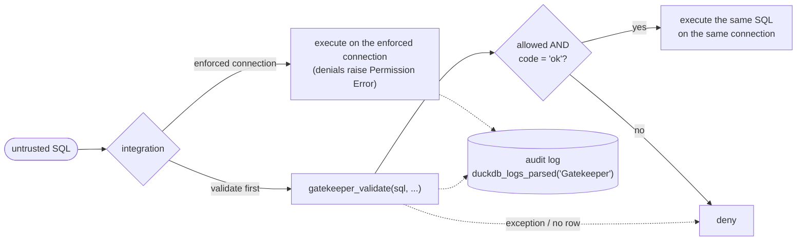
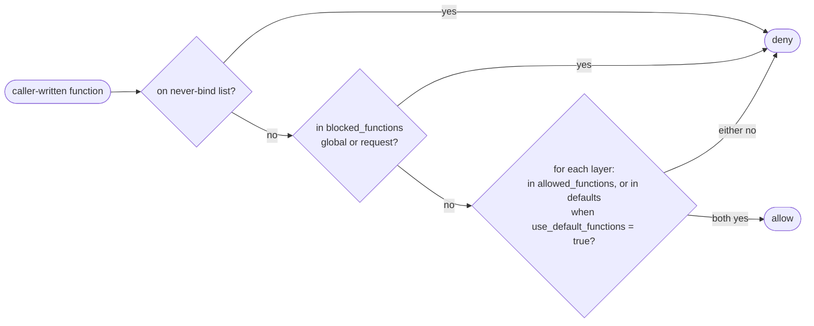
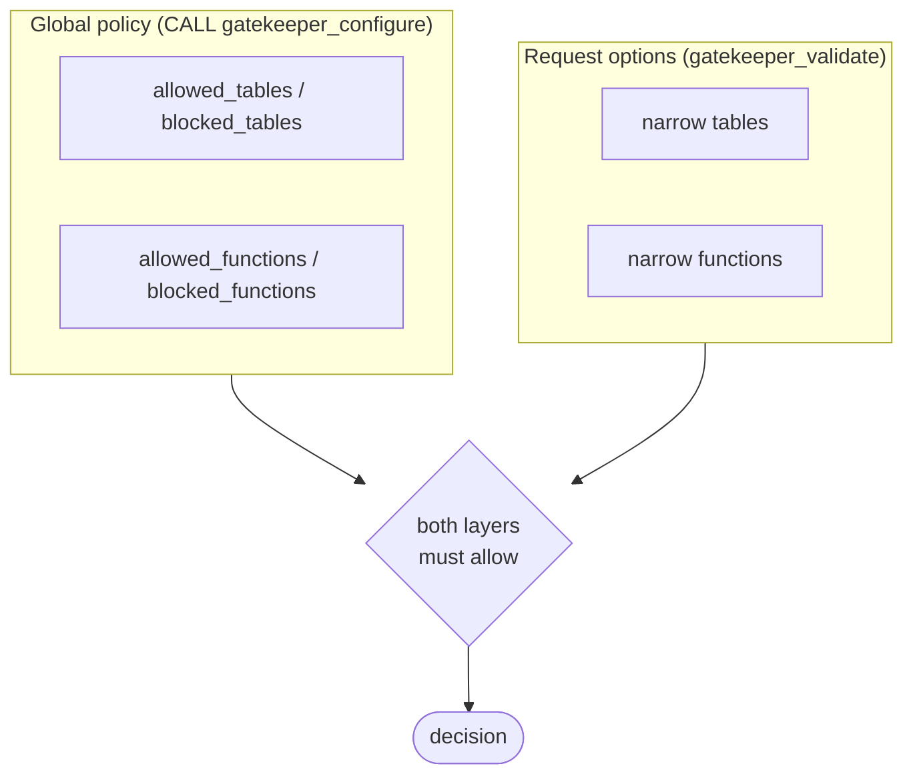

# Gatekeeper for DuckDB

A DuckDB extension that keeps untrusted SQL inside the lines you drew. Hand it a query
from a tenant, an LLM agent, or a dashboard builder and either ask it whether the query
conforms (`gatekeeper_validate`) or hand the agent an **enforced connection** on which
DuckDB itself refuses to run anything the policy denies (`CALL gatekeeper_enforce()`).

| Control | What it enforces |
| --- | --- |
| **Table ACL** | Once you configure `allowed_tables`, only the catalogs, schemas, tables, and views you allow, matched by their *resolved* identity after binding. Tables and views are **unrestricted by default**, except internal objects. |
| **Function ACL** | Only the functions you allow, starting from 953 reviewed defaults, with exact-name allow and block lists. |
| **Read-only, no introspection** | `SELECT` statements only. `INSERT`, `UPDATE`, `DROP`, `COPY`, `SET`, dynamic SQL, and catalog metadata readers (`duckdb_tables`, `information_schema.*`) are rejected. |

A lockable **global policy** sets the ceiling; per-request options can narrow it but never widen it.
Every validation decision comes back as one row of named columns with structured diagnostics;
every enforced denial is a `Permission Error` the statement never recovers from.

> [!WARNING]
> Gatekeeper is a **statement-level sandbox**, not an operating-system or resource
> sandbox. It does not filter rows, cap memory or time, or isolate the filesystem.
> Read the [security model](docs/security.md) before integrating.

> [!NOTE]
> Early development. Release binaries target **DuckDB 1.5.5**. `INSTALL gatekeeper FROM
> community` installs the latest tagged release; this README follows `main`, which can be
> ahead of it.

## Installation

```sql
INSTALL gatekeeper FROM community;
LOAD gatekeeper;
```

Community binaries are built and signed by DuckDB and load with signature verification
enabled. Source builds and the binaries attached to GitHub Releases are unsigned
development artifacts and require `allow_unsigned_extensions`; see
[loading unsigned builds](CONTRIBUTING.md#loading-unsigned-builds).

Each binary is specific to the DuckDB engine it was built from and refuses to load into
any other, even when DuckDB's own footer check is disabled. The community repository
can rebuild Gatekeeper source for newer engines; source compatibility is checked by
builds and regression tests rather than a fixed release allowlist. Default functions are a
name list: new names remain excluded until added, and existing implementations are
trusted across DuckDB upgrades.
For browsers, the DuckDB-Wasm EH bundle is supported; see
[Wasm installation and browser tests](test/wasm/README.md).

## Quickstart

```sql
CREATE SCHEMA reporting;
CREATE TABLE reporting.orders (customer_id INTEGER, amount DOUBLE);
INSERT INTO reporting.orders VALUES (1, 20), (1, 30), (2, 15);
```

Allowed table, default functions:

```sql
SELECT allowed, code FROM gatekeeper_validate(
    'SELECT customer_id, sum(amount) FROM reporting.orders GROUP BY customer_id',
    allowed_tables := [{catalog: 'memory', schema: 'reporting', 'table': 'orders'}]
);
```

| allowed | code |
| --- | --- |
| true | ok |

DDL is never allowed (the one exception is the temporary enum a dynamic `PIVOT` is rewritten
into; see [dynamic PIVOT](docs/security.md#residuals)):

```sql
SELECT allowed, code FROM gatekeeper_validate('DROP TABLE reporting.orders');
```

| allowed | code |
| --- | --- |
| false | unsupported |

Engine errors surface with their phase:

```sql
SELECT allowed, code FROM gatekeeper_validate('SELECT * FROM missing_table');
```

| allowed | code |
| --- | --- |
| false | binding |

> [!TIP]
> Two ways to integrate. **Enforced connection** (recommended for agents): run
> `CALL gatekeeper_enforce()` on the connection you hand out and execute SQL on it directly;
> denials raise. **Validate first**: require `allowed = true` **and** `code = 'ok'`, treat
> exceptions and missing results as denials, then execute the same SQL text on the same
> connection.



## Functions

```text
SELECT * FROM gatekeeper_validate(sql VARCHAR, option := value, ...) -- one result row
CALL gatekeeper_configure(option := value, ...)          -- replaces the global policy
CALL gatekeeper_enforce()                                -- enforces the global policy on this connection
```

`gatekeeper_validate` and `gatekeeper_configure` take the same named options and accept
host-bound parameters (`?`, `$1`), so policies never need to be spliced into SQL text.
Both also accept a mutually exclusive `json := document` argument for
[shared JSON policies](#json-policy-documents).
`gatekeeper_enforce` takes no options; see [Enforced connections](#enforced-connections).

Select `*` for all result columns or name just the columns you need. SQL text and
options must be constant expressions or host-bound parameters; correlated/lateral
per-row arguments are not supported. Use separate parameterized calls for multiple
SQL strings. Every execution, including a prepared execution, checks the current
global policy and binds the submitted SQL again.

| Bad input | `gatekeeper_validate` | `CALL gatekeeper_configure` |
| --- | --- | --- |
| Unknown/duplicate option name, wrong type | DuckDB error at bind | DuckDB error at bind |
| Invalid value (NULL list member, empty function name) | `code = 'invalid_input'` | Raises; policy unchanged |
| `json` mixed with typed options, or non-string `json` | DuckDB error at bind | DuckDB error at bind |
| NULL `json`, malformed JSON, or invalid policy document | `code = 'invalid_input'` | Raises; policy unchanged |

Empty option lists accept any element type, since DuckDB resolves untyped `[]` to
`INTEGER[]` before table-function binding. All-NULL lists also pass the element-type
check regardless of their declared type: `[NULL]` and `[NULL]::DOUBLE[]` both return
`invalid_input` at execution. Lists with non-NULL members require the documented
element types. Typed STRUCT lists have their field names checked even when empty.

### Options

| Option | Type | Default | Notes |
| --- | --- | --- | --- |
| `allowed_tables` | STRUCT[] | unrestricted (non-internal) | `{catalog?, schema, table}`. `'*'` matches any whole component; omitted/NULL catalog matches any. `[]` denies all tables and views. Until this is set, every non-internal table and view is readable. |
| `blocked_tables` | STRUCT[] | `[]` | Same identity rules. A match always denies what the caller names; does not reach inside trusted views, macros, or attached tables. |
| `use_default_functions` | BOOLEAN | `true` | `true`: 953 reviewed defaults **plus** `allowed_functions`. `false`: only `allowed_functions`. |
| `allowed_functions` | VARCHAR[] | `[]` | Leaf names, ASCII case-folded. `'*'` here is the multiplication operator, not a wildcard. |
| `blocked_functions` | VARCHAR[] | `[]` | Always wins over the allowlist for what the caller writes and the implementations DuckDB binds for it. Does not reach inside trusted views, macros, or attached tables. |

Validation accepts exactly one nonempty statement. DuckDB ignores empty semicolon
segments, so `SELECT 1;`, `SELECT 1;;`, and `;SELECT 1` are accepted. Empty,
semicolon-only, or comment-only SQL returns `invalid_input`, and multiple statements
return `forbidden` with violation rule `limit`. The statement cap is fixed internally,
like the AST caps.

```sql
SELECT allowed FROM gatekeeper_validate('SELECT md5(''hello'')', blocked_functions := ['md5']);
```

| allowed |
| --- |
| false |

```sql
SELECT allowed FROM gatekeeper_validate('SELECT 1+2', use_default_functions := false, allowed_functions := ['+']);
```

| allowed |
| --- |
| true |

> [!NOTE]
> Authorize replacement-scan readers through function policy (see [File readers](#file-readers)).

### JSON policy documents

Use `json := document` instead of typed options to load a policy shared as JSON. The
argument is JSON text (`VARCHAR`), including a host-bound parameter; it does not require
DuckDB's SQL JSON extension. JSON and typed options cannot appear in the same call, even
when a typed option is empty or NULL.

```json
{
  "$schema": "https://raw.githubusercontent.com/nozzle/duckdb-gatekeeper/main/docs/policy-v1.schema.json",
  "version": 1,
  "options": {
    "allowed_tables": [{"schema": "reporting", "table": "*"}],
    "blocked_functions": ["md5"]
  }
}
```

The [version 1 JSON Schema](docs/policy-v1.schema.json) provides editor completion and
document validation. `version` and `options` are required; `version` is the document
format version, independent of the DuckDB or Gatekeeper release. `$schema` is optional
and, when present, must be the schema URL above; Gatekeeper never fetches it. This exact
match rejects documents labeled for another schema, even if they retain `version: 1`.
For a vendored schema, use your editor's external schema association and omit `$schema`
from the policy document. Unknown
fields, duplicate object keys, unsupported versions, and incorrect types are rejected.
JSON Schema validators operate on parsed objects, so duplicate-key rejection must also
be enabled in your JSON parser when validating documents outside Gatekeeper.

The decoder routes through the same typed option validation and policy application:

- `gatekeeper_configure(json := ...)` replaces the global policy atomically; omitted
  options take their built-in defaults. `{"version": 1, "options": {}}` resets it.
- `gatekeeper_validate(sql, json := ...)` applies request options under the current
  global policy; omitted options inherit that policy and requests cannot widen it.
- Omitted `allowed_tables` differs from `"allowed_tables": []`, which denies all tables
  and views. Omitted or JSON `null` catalog matches any catalog; other NULL values are
  invalid. Names must be nonempty and NUL-free, just as in typed options.
- `use_default_functions: true` uses this installation's reviewed defaults; it does not
  freeze those defaults across Gatekeeper releases.

```sql
SELECT allowed FROM gatekeeper_validate(
    'SELECT md5(''hello'')',
    json := '{"version": 1, "options": {"blocked_functions": ["md5"]}}'
);
```

| allowed |
| --- |
| false |

Load a shared document from application code:

```python
from pathlib import Path

db.execute("CALL gatekeeper_configure(json := ?)", [Path("policy.json").read_text()])
```

Configuration still returns its `Success` row and validation returns the same typed
result columns. Inspect the global policy with `current_setting('gatekeeper_policy')`.

### Result

Each call returns exactly one row unless it raises an exception. `violations`,
`objects`, `functions`, and `caller_objects` remain lists of STRUCTs within their respective columns.

| Column | Type | Meaning |
| --- | --- | --- |
| `allowed` | BOOLEAN | True exactly when `code = 'ok'`. |
| `code` | VARCHAR | `ok`, `forbidden`, `unsupported`, `parser`, `binding`, `invalid_input`. |
| `violations` | STRUCT[] | `rule`, `message`, `catalog`, `schema`, `table`, `function_name`, `position`. Nonempty only for `forbidden`/`unsupported`. |
| `error_type` | VARCHAR | DuckDB exception category (`parser`, `Catalog`, `Binder`, ...) when available. Empty for `ok`/`forbidden`/`unsupported`. |
| `error_message` | VARCHAR | The engine's message; empty for policy denials. |
| `position` | BIGINT | Zero-based parser byte offset, or NULL. |
| `objects` | STRUCT[] | Resolved `catalog`, `schema`, `table`, `type` (`table`/`view`/`replacement`) the query bound to. Empty unless `ok`. |
| `functions` | STRUCT[] | Resolved `catalog`, `schema`, `name`, `type` (`scalar`, `aggregate`, `table`, `macro`, `table_macro`, `pragma`, `window`). Empty unless `ok`. |
| `caller_objects` | STRUCT[] | Caller-attributable catalog tables/views, with the same fields as `objects`. Sorted, deduplicated subset of `objects`; empty unless `ok`. |

Violation `rule` values: `function`, `table`, `internal_object`, `dynamic_sql`,
`replacement_scan`, `bind_time_expression`, `statement`, `limit`, `unsupported_structure`.

> [!TIP]
> Branch on `code` and `violations[].rule`, not on message text.

```sql
SELECT * FROM gatekeeper_validate('SELECT 1');
```

| allowed | code | violations | error_type | error_message | position | objects | functions | caller_objects |
| --- | --- | --- | --- | --- | --- | --- | --- | --- |
| true | ok | [] | '' | '' | NULL | [] | [] | [] |

In these result tables, `''` denotes an empty string and `NULL` a SQL NULL.

<details>
<summary>The three failure shapes</summary>

**Table denied:** `code = 'forbidden'`, with a structured violation and no engine
error text. Project the first violation's fields to display them as columns:

```sql
SELECT allowed, code, violations[1].rule AS rule,
       violations[1].message AS message, violations[1].catalog AS catalog,
       violations[1].schema AS schema, violations[1]."table" AS "table"
FROM gatekeeper_validate('SELECT * FROM reporting.orders', allowed_tables := []);
```

| allowed | code | rule | message | catalog | schema | table |
| --- | --- | --- | --- | --- | --- | --- |
| false | forbidden | table | object is not allowed | memory | reporting | orders |

**Function denied:** `md5` is a default, but `current_setting` (configuration inspection) is not.

```sql
SELECT allowed, code, violations[1].rule AS rule,
       violations[1].message AS message, violations[1].function_name AS function_name
FROM gatekeeper_validate('SELECT md5(''x''), current_setting(''threads'')');
```

| allowed | code | rule | message | function_name |
| --- | --- | --- | --- | --- |
| false | forbidden | function | function is not allowed: current_setting | current_setting |

**Engine error:** the code identifies the phase and `violations` is empty. This
example displays the first line of DuckDB's error message, omitting suggestions:

```sql
SELECT allowed, code, violations, error_type,
       split_part(error_message, chr(10), 1) AS error_message
FROM gatekeeper_validate('SELECT * FROM missing_table');
```

| allowed | code | violations | error_type | error_message |
| --- | --- | --- | --- | --- |
| false | binding | [] | Catalog | Table with name missing_table does not exist! |

All three denials return empty `objects`, `functions`, and `caller_objects` lists. Policy denials
have empty `error_type` and `error_message`; the details are in `violations`.

</details>

`caller_objects` contains the catalog tables/views attributable to the caller; `objects`
also includes their trusted dependencies. All evidence lists are empty unless validation
succeeds. See [declared input validation](docs/security.md#declared-input-validation) for
the comparison contract and conservative name-attribution rules.

`objects` and `functions` are sorted, deduplicated binding evidence: views appear with
their underlying tables, whether or not policy was applied to those (see
[Table ACL](#table-acl)); CTE names do not. They help detect search-path surprises but do
not prove definitions are unchanged between validation and execution.

## Table ACL

> [!IMPORTANT]
> Tables and views are unrestricted by default, except internal objects. Configure
> `allowed_tables` in the global policy to restrict access; `[]` denies all tables and views.

Rules match all three components of a **resolved** table or view identity, ASCII
case-insensitively. Any matching allow grants; any matching block wins.

```sql
SELECT allowed FROM gatekeeper_validate(
    'SELECT * FROM reporting.orders',
    allowed_tables := [{catalog: '*', schema: 'reporting', 'table': '*'}]
);
```

| allowed |
| --- |
| true |

| Intent | Rule |
| --- | --- |
| One table | `{catalog: 'memory', schema: 'reporting', 'table': 'orders'}` |
| One schema | `{schema: 'reporting', 'table': '*'}` |
| Whole catalog | `{catalog: 'warehouse', schema: '*', 'table': '*'}` |
| Everything except one | allow `{catalog: 'warehouse', schema: 'reporting', 'table': '*'}`, block `{..., 'table': 'sensitive_orders'}` |
| Nothing | `allowed_tables := []` |

Multiple entries pair specific catalogs and schemas without granting their cross-product.

Table policy applies to what the caller names. Trusted **views, macros, and attached tables**
are opaque to it, as they are to function policy: the caller must be allowed the view, table,
or macro it names, and what that definition reads is the definition's own, exempt from the
allowlist, from `blocked_tables`, and from the internal-object rule alike. Allowing
`reporting.totals` admits the `reporting.orders` behind it; blocking `reporting.orders` stops
the caller's own `FROM reporting.orders`, not the view. Block the view to withdraw it. What
the caller writes is the caller's wherever it binds: `FROM reporting.totals JOIN
reporting.orders` is checked on `reporting.orders`, and so is a CTE or alias the caller reads
under that name. A host definition that selects its table from a caller argument
(`query_table(n)` in a macro body) hands that selection to the caller; see
[trusted definitions](docs/security.md#function-enforcement-and-trusted-expansion).

> [!IMPORTANT]
> Only a whole-component `'*'` is a wildcard. `sales_*`, `?`, and `%` are literal names.
> Wildcards also match objects created or attached **later**, and `catalog: '*'` matches
> temporary shadow tables. Prefer explicit catalog names when that scope is not intended.

Internal objects (`duckdb_*`, `information_schema.*`) need exact schema and table names, and
schema-wide `SHOW` is denied under any table restriction. The complete matching rules, layer
by layer, are in [table ACL matching](docs/security.md#table-acl-matching). Table rules govern
tables and views only; types and collations are the host's, though function policy still
applies to what they bind ([callback bypasses](docs/security.md#callback-bypasses)).

## Function ACL



- Caller-written scalar, aggregate, window, and table functions (`FROM range(...)`,
  `FROM read_parquet(...)`) all use the same policy, by leaf name.
- Trusted **views, macros, and attached tables** are opaque to function policy. What
  their definitions introduce is theirs, not the caller's: exempt from the allowlist,
  from `blocked_functions`, and from the never-bind list alike, whether an explicit
  `read_parquet(...)`, a file path (`FROM 'x.parquet'`), `duckdb_tables()`, or the scan
  an attached catalog uses. Only Gatekeeper's own control plane (below) is refused
  inside a body. Table policy governs the view or table itself, and a macro must
  itself be allowed; what their bodies read is theirs too ([Table ACL](#table-acl)).
  The exemption is by origin, not by name: the same function written
  by the caller next to the view is the caller's, and ambiguous caller syntax such as
  `t.x` or `list[i]` triggers a query-wide implementation check that can also reach a
  trusted expansion using the same function (for example `struct_extract`). See
  [function enforcement and trusted expansion](docs/security.md#function-enforcement-and-trusted-expansion).
- The global policy and the request must each grant a function; a request cannot add
  one the global policy denies.

Blocks also cover the implementations DuckDB binds for the caller's own expressions:
`lower` introduced by a `COLLATE nocase` the caller wrote, `sum` dispatched by a
caller-written `list_sum`, `list_aggr` behind it. These implementations are included in
successful function dependency lists, as are the ones trusted definitions introduce.
When the caller writes a name-selected dispatcher (`list_aggregate`, `list_aggr`,
`aggregate`, `array_aggregate`, `array_aggr`), the aggregate it names is caller-chosen
text and must also be allowed in both layers, not merely unblocked.

> [!NOTE]
> Catalog, session, and configuration inspection (`current_schema`, `current_setting`,
> `getvariable`, `duckdb_tables()`) is **not** a default. Grant it by name in the global
> policy: `allowed_functions := ['current_schema']`. The clock (`current_date`, `now()`),
> the connection-local RNG (`random()`, `uuid()`, `setseed()`), and PostgreSQL
> compatibility stubs (`current_user`, `pg_typeof`) are defaults because they disclose
> nothing about the host beyond the time and its `TimeZone`/`Calendar`, and `setseed` touches only
> the connection's own random engine. The criteria are in
> [inventories/README.md](inventories/README.md#classification-criteria).

### File readers

Readers such as `read_parquet`, `read_csv`, and `read_json` are **not** defaults.
Admitting one permits its resource access; `allowed_tables` does not restrict file paths.

| Shorthand | Reader that must be allowed |
| --- | --- |
| `FROM 'x.parquet'` | `read_parquet` or `parquet_scan` (one shared permission) |
| `FROM 'x.csv'` | `read_csv_auto` (`read_csv` alone is not enough) |
| `FROM 'x.json'` | `read_json_auto` (`read_json` alone is not enough) |

The decision is made before the reader binds, so a denied path is never opened. Allowed
paths appear in `objects` with type `replacement`. Host-language scans (DataFrames,
relations in scope) are always denied. These rules govern paths the caller writes; a
path inside a host-defined view or macro body is that definition's own reader and is
outside function policy like any other trusted expansion.

### Never-bind list

Denied regardless of options, in every layer, wherever the caller's text reaches them:
dynamic SQL (`query`, `query_table`, ...), metadata readers (`duckdb_tables`,
`information_schema.*`, `SHOW TABLES`), and sequence and storage functions. A host view or
macro that uses one of these is the host's decision to expose it and is admitted when the view
is. The one exception is Gatekeeper's own control plane, `gatekeeper_configure`,
`gatekeeper_enforce`, `enable_logging`, `disable_logging`, `truncate_duckdb_logs`, and
`write_log`, which is refused on every route, views and macros included: a definition over one
of these would let a `SELECT` rewrite the policy or erase the audit trail. The full list, with
the source review behind each entry, is in
[never-bind functions](docs/security.md#never-bind-functions).

## Global policy

The global policy is a ceiling that request options can only narrow.



| Dimension | How the layers combine |
| --- | --- |
| Blocks and the never-bind list | Either layer's deny wins. |
| Allowlists (functions, tables) | Each layer must allow the resolved identity. |

```sql
CALL gatekeeper_configure(
    allowed_tables := [{catalog: 'memory', schema: 'reporting', 'table': '*'}],
    blocked_functions := ['md5']
);
```

| Success |
| --- |
| true |

```sql
SELECT allowed FROM gatekeeper_validate('SELECT md5(''hello'')', blocked_functions := []);
```

| allowed |
| --- |
| false |

The request cannot clear a global block. The global policy still lists the block:

```sql
SELECT current_setting('gatekeeper_policy').blocked_functions AS blocked_functions;
```

| blocked_functions |
| --- |
| [md5] |

A request that tries to widen access does not error; it simply cannot authorize anything
the global policy denies. Grant capabilities (such as readers) in
`CALL gatekeeper_configure`, then use request options to narrow per tenant.

| Operation | SQL |
| --- | --- |
| Inspect | `SELECT current_setting('gatekeeper_policy')` |
| Reset to built-ins | `RESET gatekeeper_policy` or `CALL gatekeeper_configure()` |
| Freeze | `SET lock_configuration = true` after trusted setup |
| Allow later changes while locked | `SET allowed_configs = ['gatekeeper_policy']` before locking |

> [!IMPORTANT]
> Each `CALL` **replaces** the policy atomically, filling omitted options from the
> built-in defaults. The policy is shared by every connection of the database instance,
> not persisted, and not undone by rollback. `SET SESSION`/`RESET SESSION` are rejected.

<details>
<summary>Setting the policy directly with <code>SET gatekeeper_policy</code></summary>

Prefer `CALL gatekeeper_configure`: it validates option names, types, and nested identity
fields before DuckDB's casts. `SET gatekeeper_policy = <STRUCT>` also works but requires
the **complete canonical STRUCT**: every option plus the `restrict_tables` flag, with no
NULL at any depth. `SET gatekeeper_policy = {blocked_functions: ['md5']}` fails with
`NULL policy field: use_default_functions`; start from
`current_setting('gatekeeper_policy')` and `struct_update` it instead.

DuckDB silently drops unknown keys during the cast: a complete canonical STRUCT with
an extra field succeeds, but that field has no effect (unlike an unknown option in
`CALL gatekeeper_configure`, which errors). Because the canonical value is NULL-free
(`catalog: ''` means any catalog), a typo that displaces a required field fails closed.
Check the readback.

When setting `allowed_tables` directly, also set `restrict_tables := true`; a nonempty
list with `restrict_tables = false` is rejected. With an empty list,
`restrict_tables = true` denies all tables/views and `false` disables the allowlist for
non-internal objects. `blocked_tables` applies regardless of `restrict_tables`.

</details>

## Enforced connections

An enforced connection is one where DuckDB itself refuses to run anything the global policy
denies. There is no host glue to forget: the agent gets a connection, every statement it
submits is checked the way `gatekeeper_validate` would check it, and the plan the engine is
about to execute is checked once more.

Enforcement is per connection, and only ever switched on: the host runs
`CALL gatekeeper_enforce()` on the connection it is about to hand out, and keeps its own
connections unenforced for the setup below, the [audit log](#audit-log), and policy changes.
There is no instance-wide enforcement switch.

| Trusted setup, in order | Why |
| --- | --- |
| Load extensions, attach catalogs | `LOAD` and `ATTACH` are refused on an enforced connection. |
| `CALL gatekeeper_configure(...)` | The policy every enforced connection follows. |
| `SET enable_external_access = false`, autoload off | Where the deployment allows; `gatekeeper_enforce()` warns when these are loose. |
| `CALL enable_logging('Gatekeeper')` | Denials go to the agent; the [audit log](#audit-log) is how the host sees them. |
| `SET gatekeeper_log_only = true`, while rolling out | Optional. Enforced connections record every decision and refuse nothing until you set it back; see [log-only mode](#log-only-mode). |
| `SET lock_configuration = true` | Freezes the policy and the log-only switch. It does not freeze `CALL disable_logging()` on host connections; only the never-bind list keeps it from enforced ones. |
| `CALL gatekeeper_enforce()` on each connection you hand out | Put it where connections are created (a factory, a pool hook) so no code path can skip it. Not inside an open transaction: an enforced connection cannot `COMMIT` or `ROLLBACK`, so the call is refused there. |

Enforce this connection:

```sql
CALL enable_logging('Gatekeeper');
SELECT enforced FROM gatekeeper_enforce();
```

| enforced |
| --- |
| true |

> [!NOTE]
> The full row also carries `warnings`, naming host settings that weaken the sandbox
> (`enable_external_access`, autoload, `lock_configuration`, log-only mode, and logging that
> would not record a denial). Gatekeeper reports them; it never changes them.

From then on, on that connection only, allowed reads work as before:

```sql
SELECT sum(amount) FROM reporting.orders;
```

| sum(amount) |
| --- |
| 65.0 |

and everything else is refused before it can execute:

```text
D CREATE TABLE scratch AS SELECT * FROM reporting.orders;
Permission Error: Gatekeeper denied this statement (unsupported): statement: only supported read statements are permitted
D SELECT * FROM read_csv('/etc/passwd');
Permission Error: Gatekeeper denied this statement: function: function is not allowed: read_csv
D SELECT * FROM secret.salaries;
Permission Error: Gatekeeper denied this statement: table: object is not allowed
```

> [!IMPORTANT]
> Enforcement is **permanent for the life of the connection**. It lives in the connection's
> own state, not in a setting, so neither `RESET` nor a native configuration write undoes it,
> and `SET`, `RESET`, and `CALL` are themselves refused on the connection. Denied statements
> are ordinary errors: the transaction survives, and the agent can try again.

### Audit log

Those errors went to the agent. The host reads the same decisions, with the text that caused
them, from any connection that is not enforced:

```text
D SELECT boundary, code, violations[1].rule AS rule, statement
  FROM duckdb_logs_parsed('Gatekeeper') WHERE event = 'decision' AND NOT allowed;
┌───────────┬─────────────┬──────────┬─────────────────────────────────────────────────────┐
│ boundary  │    code     │   rule   │                      statement                      │
├───────────┼─────────────┼──────────┼─────────────────────────────────────────────────────┤
│ binding   │ unsupported │ statement│ CREATE TABLE scratch AS SELECT * FROM reporting.ord…│
│ binding   │ forbidden   │ function │ SELECT * FROM read_csv('/etc/passwd');              │
│ authorize │ forbidden   │ table    │ SELECT * FROM secret.salaries;                      │
└───────────┴─────────────┴──────────┴─────────────────────────────────────────────────────┘
```

A decision record (`event = 'decision'`) carries the `mode` (`enforce`, `log_only`,
`validate`), the `boundary` that decided it, exactly `gatekeeper_validate`'s
[result columns](#result), the `statement` the engine ran, and the `policy_hash` of the
policy in force, under DuckDB's own `connection_id` and `query_id`. The host's own setting
changes are records too: `policy_changed` and `log_only_changed`, with the new setting in
`new_value` and, for a policy, the `policy_hash` its later decisions will carry. Column by
column, with what makes the record usable as evidence and the one path outside its control:
[audit log](docs/security.md#audit-log).

> [!TIP]
> Denials and setting changes are `INFO`. `SET logging_level = 'debug'` also records every
> allowed statement with the tables, views, and functions it resolved to: the raw material for an
> allowlist. For a durable log, `CALL enable_logging('Gatekeeper', storage := 'file',
> storage_path := '...')`. The enforced connection itself cannot read, silence, redirect, or
> write to the log.

### Log-only mode

To see what a policy would refuse before it refuses anything, turn refusals off for the whole
instance and leave everything else in place:

```text
D SET gatekeeper_log_only = true;
```

Enforced connections keep making and recording every decision exactly as before; a denial is
written to the log with `mode = 'log_only'` and the statement then runs as it would on an
unenforced connection. Set it back to `false` (or `RESET` it) and the next statement on every
enforced connection is refused again. The switch is global, frozen by `lock_configuration`, and
on the record as `log_only_changed`; the full semantics (one record per statement, what the
caller sees, which records count) are in [log-only mode](docs/security.md#log-only-mode). The
rollout, end to end:

```text
CALL enable_logging('Gatekeeper', storage := 'file', storage_path := 'gatekeeper.csv');
SET logging_level = 'debug';           -- allowed statements too, with what they resolved to
SET gatekeeper_log_only = true;
-- hand out enforced connections; run real traffic
SELECT code, violations, statement FROM duckdb_logs_parsed('Gatekeeper')
 WHERE mode = 'log_only' AND NOT allowed AND code <> 'binding';  -- what enforcement would refuse
SELECT DISTINCT o.schema, o."table" FROM duckdb_logs_parsed('Gatekeeper'), UNNEST(objects) AS t(o)
 WHERE allowed;                                                     -- a draft allowed_tables
SET gatekeeper_log_only = false;
SET lock_configuration = true;
```

> [!WARNING]
> Log-only mode protects nothing while it is on, Gatekeeper's own settings included: an agent's
> `CALL gatekeeper_configure()` or `SET gatekeeper_log_only = false` is recorded and then
> executes. If the rollout is not supervised, lock before handing out connections, and leave
> yourself the way back: `SET allowed_configs = ['gatekeeper_log_only']` first, then
> `SET lock_configuration = true`. Locked without it, log-only stays on until the process
> restarts. The exception is safe to leave open: the most it lets a log-only connection do is
> turn refusals on. When reading the trail, every denied record except `code = 'binding'` is a
> statement enforcement would have refused.

### What enforcement covers

- **Parameters** (`execute(sql, [values])`): the statement is authorized with the values it is
  bound with, and every execution, including cached prepared statements, is rebound and
  re-checked under the policy current at that moment.
- **DuckDB's relation API**: the relation's SQL rendering passes the text check and the plan
  passes the execution check.
- **Query pragmas** DuckDB rewrites into `SELECT`s before any extension runs (`PRAGMA version`)
  are checked as that `SELECT`; `gatekeeper_validate` reports the raw text as `unsupported`.
- **`gatekeeper_validate` on the enforced connection**, when the policy allows it
  (`allowed_functions := ['gatekeeper_validate']`), for agents that want the decision as a row
  before they run the statement.
- **Cost**: up to three binds per statement (a private authorizing bind, the engine's bind, and
  a rebind for prepared executions). Negligible next to model latency, measurable on hot paths
  (see [Benchmarks](#benchmarks)); keep enforced connections for untrusted callers.

> [!CAUTION]
> DuckDB **evaluates `PRAGMA` argument expressions while parsing**, before any extension runs.
> On an enforced connection `PRAGMA x(nextval('s'))` advances `s` even though the statement is
> then refused, and any scalar function the connection can see, host UDFs and `write_log`
> included, can run the same way. Table data and statements stay out of reach. Hosts that cannot
> accept this should validate first with the complete text and execute only on `allowed = true`
> and `code = 'ok'`; see the [residuals](docs/security.md#residuals) for the full boundary and
> the upstream issue.

Enforcement decides what a statement may reference and execute. Memory, time, filesystem, and
network posture remain host settings; see
[enforced connections in the security model](docs/security.md#enforced-connections).

## How it works


1. **Parse** the SQL with the connection's own parser settings (including DuckDB 1.5's
   opt-in PEG parser, which the test suite runs as a second leg) and require exactly one
   statement.
2. **Inspect the AST** for statement type, dynamic SQL, never-bind functions, and
   bind-time expressions the caller wrote.
3. **Bind** on your connection, using the caller's search path and transaction.
4. **Authorize** every resolved table and view, plus each caller-requested function,
   against both the global policy and the request layer.
5. **Check the plan**: only reviewed read operators, resolved functions and implementations
   chosen during binding pass.
6. **Return** one result row with named columns. The submitted SQL is not executed.

On an enforced connection, steps 1 to 5 run inside DuckDB's own query hooks with the
global policy as both layers, and step 5 runs once more on the plan the engine is about to
execute. A failure at any step raises; nothing executes.

> [!CAUTION]
> Binding **can perform I/O** through trusted catalogs and explicitly admitted readers.
> Type resolution can also autoload or autoinstall extensions when those settings are on.
> Provision extensions during trusted setup and disable `autoload_known_extensions` and
> `autoinstall_known_extensions` on validation connections.

### Things that surprise people

- Objects are authorized by their **resolved** identity. Views and the tables behind them
  must both pass.
- Prepared parameters validate only when DuckDB can finish binding without values
  (`WHERE id = ?`, `LIMIT ?`, `$1::INTEGER`). Bare `SELECT $1` returns `binding`.
  Deferred function binds (`list_sum($1)`) and incompatible uses of one parameter
  (`WHERE integer_column = $1 LIMIT $1`) also return `binding`; use concrete casts
  or separate parameters where appropriate.
- Expressions in bind-time positions (LIMIT, reader arguments, type parameters, PIVOT
  values) must be literals or parameters; `range(1+2)` is rejected. The one exception is a
  **correlated** call to `unnest`, `range`, or `generate_series`, whose arguments DuckDB
  evaluates per row: `FROM t, unnest(list_transform(t.arr, lambda x: x + 1))` is accepted.
- File-shaped catalog names such as `"data.parquet"` use ordinary table policy when they
  resolve to a catalog object. Unclaimed names return binding errors.
- Function policies apply by name, so blocking a table function also blocks a scalar
  function sharing that name. To deny default row generators, add them to
  `blocked_functions` or set `use_default_functions := false`.

## Python

```python
import duckdb

db = duckdb.connect()
db.execute("INSTALL gatekeeper FROM community")
db.execute("LOAD gatekeeper")
db.execute("CREATE SCHEMA reporting")
db.execute("CREATE TABLE reporting.orders AS SELECT 20.0 AS amount")

# Trusted setup: install the ceiling, turn on the audit log, then lock it.
tables = [{"catalog": "memory", "schema": "reporting", "table": "*"}]
db.execute("CALL gatekeeper_configure(allowed_tables := ?)", [tables])
db.execute("CALL enable_logging('Gatekeeper')")
db.execute("SET gatekeeper_log_only = false")  # true while rolling out: record denials, refuse nothing
db.execute("SET lock_configuration = true")

# Enforced connection: hand this cursor to the agent. Denials raise duckdb.PermissionException.
agent = db.cursor()
agent.execute("CALL gatekeeper_enforce()")
rows = agent.execute("SELECT sum(amount) FROM reporting.orders WHERE amount > ?", [10]).fetchall()

# Validate-first alternative, for hosts that cannot hand out a dedicated connection.
sql = "SELECT sum(amount) FROM reporting.orders"
result = db.execute(
    "SELECT * FROM gatekeeper_validate(?, allowed_tables := ?)", [sql, tables]
)
row = result.fetchone()
if row is None:
    raise PermissionError("Missing validation result")
decision = dict(zip((column[0] for column in result.description), row))
if not decision["allowed"] or decision["code"] != "ok":
    raise PermissionError(decision["violations"] or decision["error_message"])
rows = db.execute(sql).fetchall()
```

To run a source build instead, replace the install/load lines with the
[unsigned build setup](CONTRIBUTING.md#loading-unsigned-builds). Recommended
validating-connection settings (`autoload_known_extensions = false`, memory and thread
limits, `lock_configuration`) are in the
[security model](docs/security.md#validating-connection-profiles).

## Limitations

Gatekeeper authorizes what a statement **references** and, on enforced connections, what
it **executes**. It does not:

- filter rows or columns;
- enforce execution deadlines or memory budgets;
- isolate the filesystem or network;
- prevent binding from performing I/O through trusted views and macros before a denial,
  or before a denial of a prepared statement, which DuckDB binds before any extension hook runs;
- stop DuckDB's statement preprocessor from evaluating `PRAGMA` argument expressions during
  parsing, before any extension hook, which can run any scalar function the connection can see,
  `write_log` into the audit log included;
- stop that same preprocessor from running query pragmas such as `import_database`, which reads
  `schema.sql` and `load.sql` before any hook when external access allows it;
- prove that every overload of a default function is harmless (defaults are a
  [reviewed name inventory](inventories/README.md)).

The full list is in [docs/security.md](docs/security.md): the engine behaviors Gatekeeper cannot
reach under [residuals](docs/security.md#residuals), and everything else under
[remaining boundaries](docs/security.md#remaining-boundaries).
Report suspected authorization bypasses privately; see [SECURITY.md](SECURITY.md).

## Benchmarks

What each way of running Gatekeeper adds to a statement, against the same statement on a
plain connection:

| | point lookup (1 K rows) | aggregate (10 M rows) | large statement (11 KB) |
| --- | ---: | ---: | ---: |
| plain connection | 68 µs | 3.8 ms | 4.1 ms |
| enforced connection | 96 µs (+29 µs) | 4.0 ms (+188 µs) | 7.4 ms (+3.3 ms) |
| enforced, audit log at debug | 148 µs (+80 µs) | 4.1 ms (+335 µs) | 7.5 ms (+3.5 ms) |
| validate, then execute | 236 µs (+168 µs) | 4.3 ms (+481 µs) | 7.6 ms (+3.5 ms) |
| denied on an enforced connection | 218 µs | 384 µs | 2.6 ms |

Median of 1000 runs per cell after 20 warm-ups, `execute().fetchall()` through the Python
client on one connection of an in-memory database; Apple M3 Max, DuckDB 1.5.5, Gatekeeper
0.2.0. The plain row is the client round trip plus the engine's own work; in parentheses, what
each mode adds to it.

The check is a second parse and bind of the statement plus the AST walk, so its cost follows
the statement's size, not the data's: tens of microseconds for a short statement, about the
engine's own bind again for a long one. After a scan large enough to flush the caches it runs
cold, a few hundred microseconds against milliseconds of query. Writing a decision record at
debug costs about as much again as the check. `gatekeeper_validate` runs that same check; the
rest of its row is the second client round trip, which carries a parameter. A refusal never
reaches the engine; what it costs is the check and the error itself, a C++ exception surfacing
through the client. Regenerate the table on a
[source build](CONTRIBUTING.md#building) with `.venv/bin/python scripts/benchmark.py --markdown`.

## License

[MIT](LICENSE). See [NOTICE](NOTICE) for provenance and third-party requirements.
