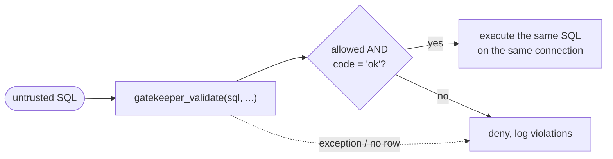
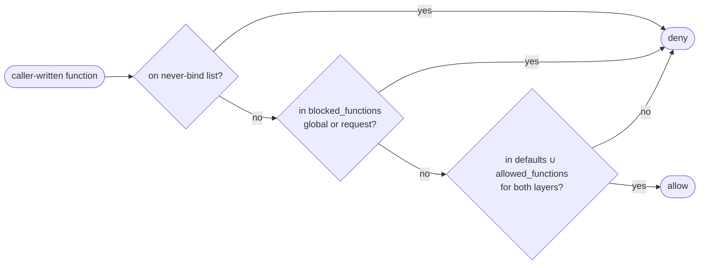
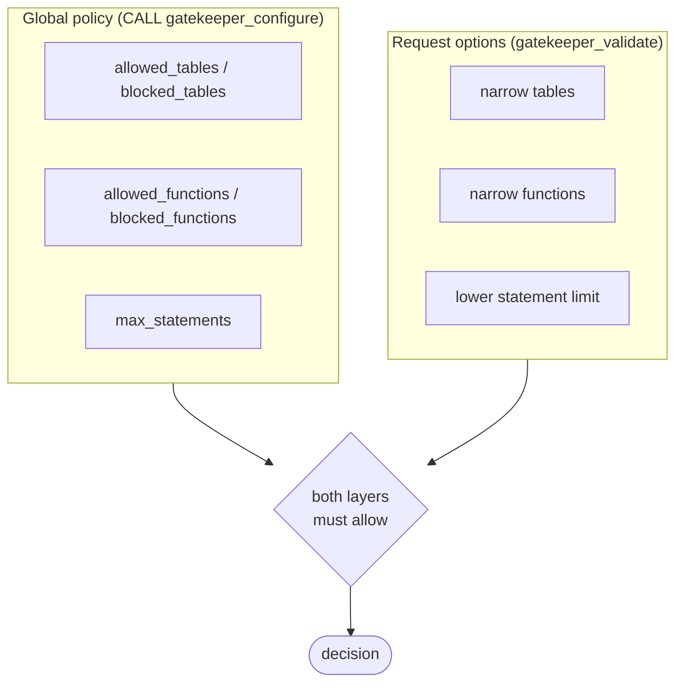

# Gatekeeper for DuckDB

[Security model](docs/security.md) · [Function inventories](inventories/README.md) · [Contributing](CONTRIBUTING.md)

A DuckDB extension that validates untrusted SQL against a policy **before** you run it.
Hand it a query from a tenant, an LLM, or a dashboard builder and it tells you whether
that query stays inside the lines you drew.

| Control | What it enforces |
| --- | --- |
| **Table ACL** | Only the catalogs, schemas, tables, and views you allow, matched by their *resolved* identity after binding. |
| **Function ACL** | Only the functions you allow, starting from 864 reviewed read-only defaults, with exact-name allow and block lists. |
| **No DML/DDL** | Read-only statements only. `INSERT`, `UPDATE`, `DROP`, `COPY`, `SET`, dynamic SQL, and metadata readers are rejected. |

A lockable **global policy** sets the ceiling; per-request options can narrow it but never widen it.
Every decision comes back as a native STRUCT with structured diagnostics.

> [!WARNING]
> Gatekeeper is a **pre-execution validator, not a sandbox**. It does not filter rows,
> cap memory or time, or isolate the filesystem. Read the
> [security model](docs/security.md) before integrating.

> [!NOTE]
> Early development. Targets **DuckDB 1.5.5 only**; community publication is pending.

## Installation

```sql
INSTALL gatekeeper FROM community;
LOAD gatekeeper;
```

> [!IMPORTANT]
> The `community` install becomes available once Gatekeeper is accepted into the DuckDB
> community repository. Until then, follow the
> [build and local-load instructions](CONTRIBUTING.md#building) and
> [loading unsigned builds](CONTRIBUTING.md#loading-unsigned-builds).

Gatekeeper is pinned to exactly DuckDB **1.5.5**. New DuckDB releases, including patches,
require a coordinated review and rebuild, so Gatekeeper may lag a newer engine.
For browsers, the DuckDB-Wasm EH bundle is supported; see
[Wasm installation and browser tests](test/wasm/README.md).

## Quickstart

```sql
CREATE SCHEMA reporting;
CREATE TABLE reporting.orders (customer_id INTEGER, amount DOUBLE);
INSERT INTO reporting.orders VALUES (1, 20), (1, 30), (2, 15);
```

Allowed table, default functions:

```sql
SELECT gatekeeper_validate(
    'SELECT customer_id, sum(amount) FROM reporting.orders GROUP BY customer_id',
    allowed_tables := [{catalog: 'memory', schema: 'reporting', 'table': 'orders'}]
).allowed;
-- true
```

DDL is never allowed:

```sql
SELECT gatekeeper_validate('DROP TABLE reporting.orders').code;
-- unsupported
```

Engine errors surface with their phase:

```sql
SELECT gatekeeper_validate('SELECT * FROM missing_table').code;
-- binding
```

> [!TIP]
> Require `allowed = true` **and** `code = 'ok'`. Treat exceptions and missing results as
> denials. Then execute the same SQL text on the same connection.



## Functions

```text
gatekeeper_validate(sql VARCHAR, option := value, ...)   -- returns the result STRUCT
CALL gatekeeper_configure(option := value, ...)          -- replaces the global policy
```

Both take the same named options and accept host-bound parameters (`?`, `$1`), so
policies never need to be spliced into SQL text.

| Bad input | `gatekeeper_validate` | `CALL gatekeeper_configure` |
| --- | --- | --- |
| Unknown/duplicate option name, wrong type | DuckDB error at bind | DuckDB error at bind |
| Invalid value (`max_statements := 0`, NULL list member) | `code = 'invalid_input'` | Raises; policy unchanged |

### Options

| Option | Type | Default | Notes |
| --- | --- | --- | --- |
| `allowed_tables` | STRUCT[] | unrestricted (non-internal) | `{catalog?, schema, table}`. `'*'` matches any whole component; omitted/NULL catalog matches any. `[]` denies all tables and views. |
| `blocked_tables` | STRUCT[] | `[]` | Same identity rules. A match always denies, including inside views and macros. |
| `use_default_functions` | BOOLEAN | `true` | `true`: 864 reviewed defaults **plus** `allowed_functions`. `false`: only `allowed_functions`. |
| `allowed_functions` | VARCHAR[] | `[]` | Leaf names, ASCII case-folded. `'*'` here is the multiplication operator, not a wildcard. |
| `blocked_functions` | VARCHAR[] | `[]` | Always wins, including inside trusted views and macros. |
| `max_statements` | BIGINT | `1` | Positive; at most 1000. |

```sql
SELECT gatekeeper_validate('SELECT md5(''hello'')', blocked_functions := ['md5']).allowed;
-- false
```

```sql
SELECT gatekeeper_validate('SELECT 1+2', use_default_functions := false, allowed_functions := ['+']).allowed;
-- true
```

> [!NOTE]
> The former `allow_replacement_scans` option has been removed. Authorize the substituted
> reader through function policy instead (see [File readers](#file-readers)).

### Result

| Field | Type | Meaning |
| --- | --- | --- |
| `allowed` | BOOLEAN | True exactly when `code = 'ok'`. |
| `code` | VARCHAR | `ok`, `forbidden`, `unsupported`, `parser`, `binding`, `invalid_input`. |
| `violations` | STRUCT[] | `rule`, `message`, `catalog`, `schema`, `table`, `function_name`, `position`. Nonempty only for `forbidden`/`unsupported`. |
| `error_type` | VARCHAR | DuckDB exception category (`parser`, `Catalog`, `Binder`, ...) when available. Empty for `ok`/`forbidden`/`unsupported`. |
| `error_message` | VARCHAR | The engine's message; empty for policy denials. |
| `position` | BIGINT | Zero-based parser byte offset, or NULL. |
| `objects` | STRUCT[] | Resolved `catalog`, `schema`, `table`, `type` (`table`/`view`/`replacement`) the query bound to. Empty unless `ok`. |
| `functions` | STRUCT[] | Resolved `catalog`, `schema`, `name`, `type` (`scalar`, `aggregate`, `table`, `macro`, `table_macro`, `pragma`, `window`). Empty unless `ok`. |

Violation `rule` values: `function`, `table`, `internal_object`, `dynamic_sql`,
`replacement_scan`, `bind_time_expression`, `statement`, `limit`, `unsupported_structure`.

> [!TIP]
> Branch on `code` and `violations[].rule`, not on message text.

<details>
<summary>The three failure shapes</summary>

```jsonc
// Policy denial: code 'forbidden', structured violations, no error text.
// SELECT * FROM hr.salaries with allowed_tables := [{catalog:'*', schema:'reporting', 'table':'*'}]
{ "allowed": false, "code": "forbidden",
  "violations": [{ "rule": "table", "message": "object is not allowed",
                   "catalog": "memory", "schema": "hr", "table": "salaries",
                   "function_name": "", "position": null }],
  "error_type": "", "error_message": "", "position": null, "objects": [], "functions": [] }

// Function not in the defaults (md5 is; current_date is not).
// SELECT md5('x'), current_date
{ "allowed": false, "code": "forbidden",
  "violations": [{ "rule": "function", "message": "resolved function is not allowed: current_date",
                   "catalog": "", "schema": "", "table": "", "function_name": "current_date",
                   "position": null }],
  "error_type": "", "error_message": "", "position": null, "objects": [], "functions": [] }

// Engine error: code names the phase, violations are empty, the message is DuckDB's.
// SELECT * FROM missing_table
{ "allowed": false, "code": "binding", "violations": [],
  "error_type": "Catalog", "error_message": "Table with name missing_table does not exist!",
  "position": null, "objects": [], "functions": [] }
```

</details>

`objects` and `functions` are sorted, deduplicated binding evidence: views appear with
their underlying tables; CTE names do not. They help detect search-path surprises but do
not prove definitions are unchanged between validation and execution.

## Table ACL

Rules match all three components of a **resolved** table or view identity, ASCII
case-insensitively. Any matching allow grants; any matching block wins.

```sql
SELECT gatekeeper_validate(
    'SELECT * FROM reporting.orders',
    allowed_tables := [{catalog: '*', schema: 'reporting', 'table': '*'}]
).allowed;
-- true
```

| Intent | Rule |
| --- | --- |
| One table | `{catalog: 'memory', schema: 'reporting', 'table': 'orders'}` |
| One schema | `{schema: 'reporting', 'table': '*'}` |
| Whole catalog | `{catalog: 'warehouse', schema: '*', 'table': '*'}` |
| Everything except one | allow `{catalog: 'warehouse', schema: 'reporting', 'table': '*'}`, block `{..., 'table': 'sensitive_orders'}` |
| Nothing | `allowed_tables := []` |

Multiple entries pair specific catalogs and schemas without granting their cross-product.
Blocks apply to views and their underlying tables, including references introduced by
macros; they match resolved objects, not CTE names, file paths, or reader arguments.

> [!IMPORTANT]
> Only a whole-component `'*'` is a wildcard. `sales_*`, `?`, and `%` are literal names.
> Wildcards also match objects created or attached **later**, and `catalog: '*'` matches
> temporary shadow tables. Prefer explicit catalog names when that scope is not intended.

> [!NOTE]
> **Internal objects** (`duckdb_*`, `information_schema.*`) need a rule with exact schema
> and table names in each policy layer; wildcards never grant them, but block wildcards
> do match them. Metadata *readers* stay on the never-bind list regardless. Schema-wide
> `SHOW` is denied whenever any table restriction is configured; `DESCRIBE table` checks
> the resolved table normally.

Table rules govern tables and views only. Types, casts, and collations are trusted as
part of the host-configured database and need no Gatekeeper permission.

## Function ACL



- Caller-written scalar, aggregate, window, and table functions (`FROM range(...)`,
  `FROM read_parquet(...)`) all use the same policy, by leaf name.
- Functions that trusted **views and macros** introduce internally skip the allowlist
  but still honor `blocked_functions` and the never-bind list.
- The global policy and the request must each grant a function; a request cannot add
  one the global policy denies.

> [!NOTE]
> `current_date`, `current_user`, and other session-value functions are **not** defaults.
> Grant them by name in the global policy: `allowed_functions := ['current_date']`.

### File readers

Readers such as `read_parquet`, `read_csv`, and `read_json` are **not** defaults.
Admitting one permits its resource access; `allowed_tables` does not restrict file paths.

| Shorthand | Reader that must be allowed |
| --- | --- |
| `FROM 'x.parquet'` | `read_parquet` or `parquet_scan` (one shared permission) |
| `FROM 'x.csv'` | `read_csv_auto` (`read_csv` alone is not enough) |
| `FROM 'x.json'` | `read_json_auto` (`read_json` alone is not enough) |

The decision is made before the reader binds, so a denied path is never opened. Allowed
paths appear in `objects` with type `replacement`. Host-language scans (DataFrames,
relations in scope) are always denied.

### Never-bind list

Denied regardless of options, in every layer:

- Dynamic SQL: `query`, `query_table`, `json_execute_serialized_sql`, `json_serialize_plan`
- Metadata readers: `duckdb_tables`, `information_schema.*`, `SHOW TABLES`
- Sequence and storage functions
- `gatekeeper_configure` itself, including through views or macros

The full list is in [docs/security.md](docs/security.md#never-bind-functions).

## Global policy

The global policy is a ceiling that request options can only narrow.



| Dimension | How the layers combine |
| --- | --- |
| Blocks and the never-bind list | Either layer's deny wins. |
| Allowlists (functions, tables) | Each layer must allow the resolved identity. |
| Statement limit | The stricter value applies. |

```sql
CALL gatekeeper_configure(
    allowed_tables := [{catalog: 'memory', schema: 'reporting', 'table': '*'}],
    blocked_functions := ['md5']
);
```

```sql
SELECT gatekeeper_validate('SELECT md5(''hello'')', blocked_functions := []).allowed;
-- false: the request cannot clear a global block
```

A request that tries to widen access does not error; it simply cannot authorize anything
the global policy denies. Grant capabilities (readers, higher statement limits) in
`CALL gatekeeper_configure`, then use request options to narrow per tenant.

| Operation | SQL |
| --- | --- |
| Inspect | `SELECT current_setting('gatekeeper_policy')` |
| Reset to built-ins | `RESET gatekeeper_policy` or `CALL gatekeeper_configure()` |
| Freeze | `SET lock_configuration = true` after trusted setup |
| Allow later changes while locked | `SET allowed_configs = ['gatekeeper_policy']` before locking |

> [!IMPORTANT]
> Each `CALL` **replaces** the policy atomically, filling omitted options from the
> built-in defaults. The policy is shared by every connection of the database instance,
> not persisted, and not undone by rollback. `SET SESSION`/`RESET SESSION` are rejected.

<details>
<summary>Setting the policy directly with <code>SET gatekeeper_policy</code></summary>

Prefer `CALL gatekeeper_configure`: it validates option names, types, and nested identity
fields before DuckDB's casts. `SET gatekeeper_policy = <STRUCT>` also works but requires
the **complete canonical STRUCT**: every option plus the `restrict_tables` flag, with no
NULL at any depth. `SET gatekeeper_policy = {max_statements: 2}` fails with
`NULL policy field: use_default_functions`; start from
`current_setting('gatekeeper_policy')` and `struct_update` it instead.

DuckDB silently drops unknown keys during the cast; because the canonical value is
NULL-free (`catalog: ''` means any catalog), a typo that displaces a required field fails
closed. Check the readback.

When setting `allowed_tables` directly, also set `restrict_tables := true`; a nonempty
list with `restrict_tables = false` is rejected. With an empty list,
`restrict_tables = true` denies all tables/views and `false` disables the allowlist for
non-internal objects. `blocked_tables` applies regardless of `restrict_tables`.

For `CALL gatekeeper_configure`, an empty non-STRUCT list for `allowed_tables` means an
empty restriction regardless of element type (DuckDB converts an untyped `[]` to
`INTEGER[]` before the callback). Nonempty lists require structs, and typed STRUCT lists
have their field names checked even when empty.

</details>

## How it works


1. **Parse** the statement and enforce `max_statements`.
2. **Inspect the AST** for statement type, dynamic SQL, never-bind functions, and
   bind-time expressions the caller wrote.
3. **Bind** on your connection, using the caller's search path and transaction.
4. **Authorize** every resolved table and view, plus each caller-requested function,
   against both the global policy and the request layer.
5. **Return** the result STRUCT. Nothing is executed.

> [!CAUTION]
> Binding **can perform I/O** through trusted catalogs and explicitly admitted readers.
> Type resolution can also autoload or autoinstall extensions when those settings are on.
> Provision extensions during trusted setup and disable `autoload_known_extensions` and
> `autoinstall_known_extensions` on validation connections.

### Things that surprise people

- Objects are authorized by their **resolved** identity. Views and the tables behind them
  must both pass.
- Prepared parameters validate only when DuckDB can finish binding without values
  (`WHERE id = ?`, `LIMIT ?`, `$1::INTEGER`). Bare `SELECT $1` returns `binding`.
- Expressions in bind-time positions (LIMIT, reader arguments, type parameters, PIVOT
  values) must be literals or parameters; `range(1+2)` is rejected. The one exception is a
  **correlated** call to `unnest`, `range`, or `generate_series`, whose arguments DuckDB
  evaluates per row: `FROM t, unnest(list_transform(t.arr, lambda x: x + 1))` is accepted.
- File-shaped catalog names such as `"data.parquet"` use ordinary table policy when they
  resolve to a catalog object. Unclaimed names return binding errors.
- Function policies apply by name, so blocking a table function also blocks a scalar
  function sharing that name. To deny default row generators, add them to
  `blocked_functions` or set `use_default_functions := false`.

## Python

```python
import duckdb

db = duckdb.connect()
db.execute("INSTALL gatekeeper FROM community")
db.execute("LOAD gatekeeper")
db.execute("CREATE SCHEMA reporting")
db.execute("CREATE TABLE reporting.orders AS SELECT 20.0 AS amount")

# Trusted setup: install the ceiling, then lock it.
tables = [{"catalog": "memory", "schema": "reporting", "table": "*"}]
db.execute("CALL gatekeeper_configure(allowed_tables := ?)", [tables])
db.execute("SET lock_configuration = true")

sql = "SELECT sum(amount) FROM reporting.orders"
decision = db.execute(
    "SELECT gatekeeper_validate(?, allowed_tables := ?)", [sql, tables]
).fetchone()[0]
if not decision["allowed"] or decision["code"] != "ok":
    raise PermissionError(decision["violations"] or decision["error_message"])
rows = db.execute(sql).fetchall()
```

Until publication, replace the install/load lines with the
[unsigned build setup](CONTRIBUTING.md#loading-unsigned-builds). Recommended
validating-connection settings (`autoload_known_extensions = false`, memory and thread
limits, `lock_configuration`) are in the
[security model](docs/security.md#validating-connection-profiles).

## Limitations

Gatekeeper authorizes what a statement **references**. It does not:

- filter rows or columns;
- enforce execution deadlines or memory budgets;
- isolate the filesystem or network;
- prevent binding from performing I/O before a denial is returned;
- prove that every overload of a default function is harmless (defaults are a reviewed
  name inventory).

The full list of boundaries is in [docs/security.md](docs/security.md#remaining-boundaries).

## License

[MIT](LICENSE). See [NOTICE](NOTICE) for provenance and third-party requirements.
